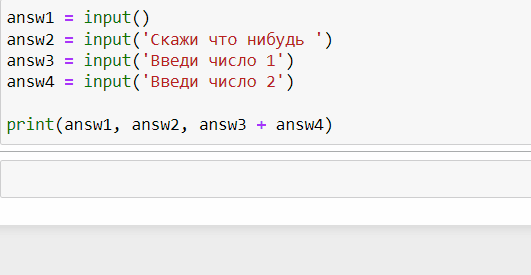

# Input

**Input** позваляет вводить данные в программу в **Python**. Функция принимает на вход строку, которая будет показана пользователю. **input** всегда возвращает строку
```py
>>> answ1 = input()
>>> answ2 = input('Скажи что нибудь ')
>>> answ3 = input('Введи число 1')
>>> answ4 = input('Введи число 2')

>>> print(answ1, answ2, answ3 + answ4)
```
