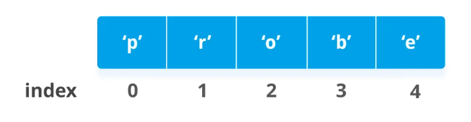

# Список

**Список** - это упорядоченная коллекция(набор) данных(обтектов) языка **Python**

## Создание
Существует несколько способов создания списков:
```py
# Буквальный
lst = [] # пустой список
lst = [1, 2, 3, 4] # Список из чисел
lst = ['2', 'a', 'b'] # Список из строк
lst = [1, 3, '2', '3', 0, [], ()] # Список из разных типов данных

# С помощью ключевого слова list
lst = list()
```

## Индексация 

**Список** - это упорядоченный тип данных, каждому элементу списка присвоен номер(индекс)

**Индексация** списка начинается с 0


Мы можем использовать **индекс**, чтобы получать по нему значение из списка
```py
# Создаем список из строки
>>> lst = list('Hello World')
>>> print(lst)
['H', 'e', 'l', 'l', 'o', ' ', 'W', 'o', 'r', 'l', 'd']

# 0 индекс
>>> print(lst[0])
H
>>> print(lst[2])
l
>>> print(lst[7])
o
```
Индексировать списки можно и отрицательными значениями. В данном случае значения выдаются с конца списка начиная, со значения **-1**

```py
#      0  1  2  3  4 - положительная индексация
#     -5 -4 -3 -2 -1 - отрицательная
lst = [1, 2, 3, 4, 5]

>>> print(lst[1])
2
>>> print(lst[-1])
5
```
## Встроенные методы списков:

| Метод                     | Что делает                                                                                                            |
| ------------------------- | --------------------------------------------------------------------------------------------------------------------- |
| append(x)                 | Добавляет элемент в конец списка                                                                                      |
| extend(L)                 | Расширяет список, добавляя в конец все элементы списка L                                                              |
| insert(i, x)              | Вставляет на i-ый индекс значение x, все остальные элементы смещаются вправо                                          |
| remove(x)                 | Удаляет первый элемент в списке, имеющий значение x. **ValueError**, если такого элемента не существует               |
| pop([i])                  | Удаляет i-ый элемент и **возвращает его**. По умолчаию удаляется последний элемент                                    |
| index(x, [start [, end]]) | Возвращает положение первого элемента со значением x (при этом поиск ведется от start до end)                         |
| count(x)                  | Возвращает количество элементов со значением x                                                                        |
| sort()                    | Сортирует список а альфанумерическом порядке. Принимает аргументом функцию, которая позволяет изменить тим сортировки |
| reverse()                 | Разворачивает список                                                                                                  |
| copy()                    | Поверхностная(Shallow) копия списка                                                                                   |
| clear()                   | Удаляет все значения из списка                                                                                        |

```py
>>> lst = ['1', '3', '4']
['1', '3', '4']
>>> lst.append('hi')
>>> print(lst)
['1', '3', '4', 'hi']
>>> lst.append('there')
>>> print(lst)
['1', '3', '4', 'hi', 'there']
>>> lst.extend(['2', '3', '4'])
>>> print(lst)
['1', '3', '4', 'hi', 'there', '2', '3', '4']
>>> element = lst.pop()
>>> print(element, lst)
4 ['1', '3', '4', 'hi', 'there', '2', '3']
>>> print(lst.index('3'))
1
>>> print(lst.count('3'))
2
>>> lst.sort()
>>> print(lst)
['1', '2', '3', '3', '4', 'hi', 'there']
>>> lst.reverse()
>>> print(lst)
['there', 'hi', '4', '3', '3', '2', '1']
>>> lst_copy = lst.copy()
>>> lst.clear()
>>> print(lst)
[]
```