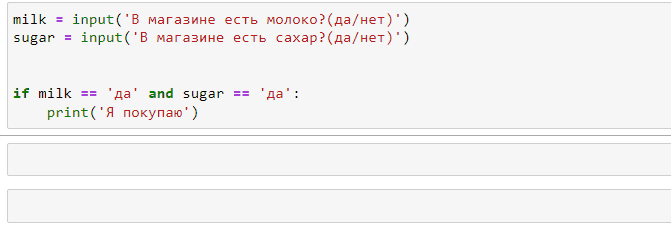
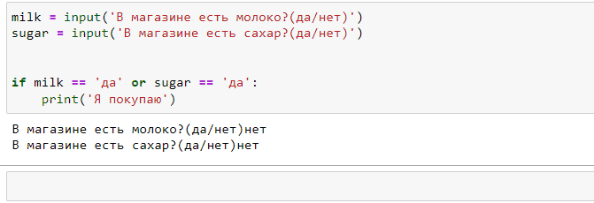

# and и or

**and** и **or** позволяют объединять несколько условий

При этом  **and** -  это строгий оператор. В результате будет True, только если все значения True

**or** - не строгий оператор и возврщает True, если хотя бы одно условие истинно
```py
# and - строгое условие
>>> print(True and True)
True
>>> print(True and False)
False
>>> print(False and False)
False

# or - не строгое условие
>>> print(True or True)
True
>>> print(True or False)
True
>>> print(False or False)
True
```

## Примеры


Мама отправляет вас в магазин и просит купить молоко и сахар. 
Но только если и молоко и сахар есть в магазине одновременно:


Мама отправляет вас в магазин и просит купить молоко и сахар. 
Она просит купить хотя бы что-то из этого:
