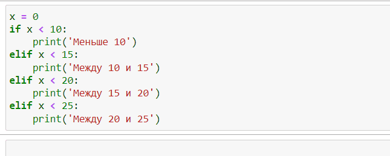
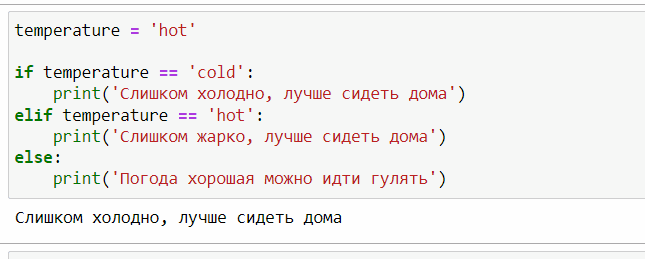

# elif

Ключевое слове **elif** используются если нам необходимо проверить больше 1 условия и для нас есть приоритет  между условиями и интересует только выполнение одного из них.

Вторым хорошим применением для **elif** служит случай, когда мы перечисляем пару условий

а все остальные переходят в **else**

Не следует использовать elif если условия взаимоисключаемые и можно просто использовать if