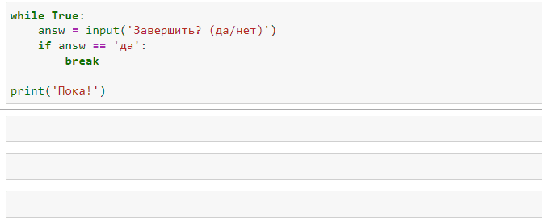
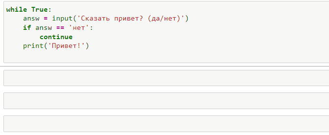

# Break / Continue

## Break

Опреатор **break** досрочно прерывает выполнения цикла. 
Как только выполняется **break** цикл завершается

```py
>>> for i in range(3):
>>>    print(i)
0
1
2

>>>for i in range(3):
>>>    print(i)
>>>    break
0

# Ничего не произойдет поскольку цикл 
# прерывается не успев ничего сделать
>>>for i in range(3):
>>>    break
>>>    print(i)

```
Мы можем комбинированить **break**, к примеру, с **бесконечным циклом**. 
<br>
В данном случае мы завершаем цикл когда выполняется **break**


## Continue

Опреатор **continue** досрочно переходит на новую итерацию цикла, игнорирую весь код ниже

```py
>>> for i in range(3):
>>>    print(i)
0
1
2

>>> for i in range(3):
>>>    if i == 0:
>>>        continue
>>>    print(i)
1
2

# Ничего не произойдет 
# Потому что continue будет всегда
# Переводить на следующую итерацию
>>> for i in range(3):
>>>    continue
>>>    print(i)


```

Пример: 

