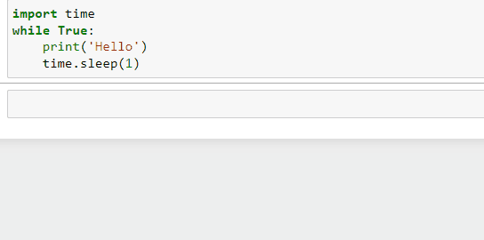

# while

Цикл while - это условный цикл
Он выполняется до тех пор, пока условие истинно

### Синтаксис
```py
while condition:
    #do code
```

1. Ключевое слово **while**

2. Условие (==, <, > ...)

3. : - двоеточие на конце

4. Весь код внутри цикла с отступом


Пример цикла, который печатает на консоль числа от **0** до **10**
```py
>>> i = 0
>>> while i <= 10:
>>>     print(i)
>>>     i += 1
0
1
2
3
4
5
6
7
8
9
10
```
Цикл, в котором, условие всегда истинно, называют **бесконечным**
```py
import time
while True:
    print('Hello')
    time.sleep(1)
```


Весь код с отступом выполняется внутри цикла. Код на уровне цикла выполняется после
```py
>>> import time
>>> while True:
>>>     print('Я внутри цикла')
>>>     break
>>> print('А я уже вне цикла')

Я внутри цикла
А я уже вне цикла
```